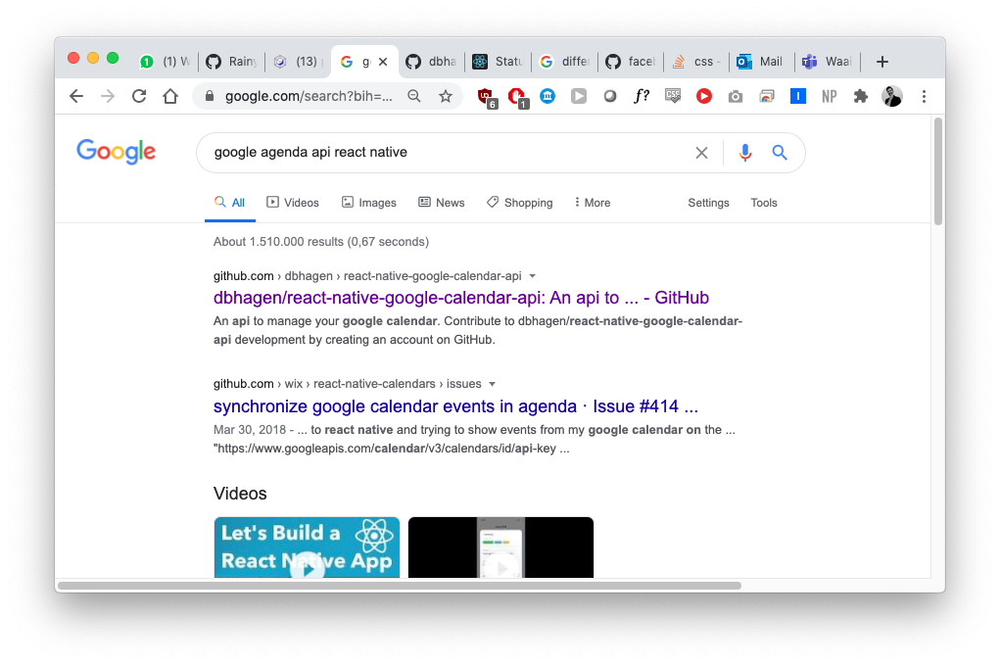
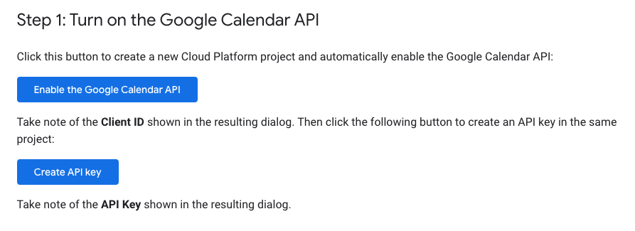

# Learnings

## By default children are only as wide as they need to be


Here I tried to put `HomeScreen` in `Container` and the `HomeScreen`
component, although it has `flex: 1` it takes exactly the space it needs.

## Padding vs Margin

* **Padding** is the amount between the content and the border
* **Margin** is the amount between two elements

This is with a border but with no margin and no padding. 


## Standing on the shoulders of giants




```
 ~/Documents/Projects/project-l   master 
 ➜  npm install --save react-google-calendar-api

Unhandled rejection Error: EACCES: permission denied, open '/Users/janmeppe/.npm/_cacache/index-v5/39/a3/7b117305bfc1aab7888d1946886be59b861a011320712db72a490298c163'

npm ERR! cb() never called!

npm ERR! This is an error with npm itself. Please report this error at:
npm ERR!     <https://npm.community>

npm ERR! A complete log of this run can be found in:
npm ERR!     /Users/janmeppe/.npm/_logs/2020-07-07T10_56_42_387Z-debug.log
```

I know I tried this before 

```
sudo npm install --unsafe-perm=true --allow-root
```

Let's try clearing the cache found [here](https://stackoverflow.com/questions/50639690/on-npm-install-unhandled-rejection-error-eacces-permission-denied)

```
sudo npm cache clean --force --unsafe-perm
```

Big oof

```
npm WARN using --force I sure hope you know what you are doing.
```

That seemed to fix the issue.

## Setting up Oauth2 is a ... ....! 

What a hassle... geez ... 

struggling with this

https://developers.google.com/calendar

https://developers.google.com/calendar/auth

>Every request your application sends to the Google Calendar API must include an authorization token. The token also identifies your application to Google. 

I guess that we are forced to use this. 

I went here https://developers.google.com/calendar/quickstart/js

And clicked on these two buttons which gave me my credentials ... 


