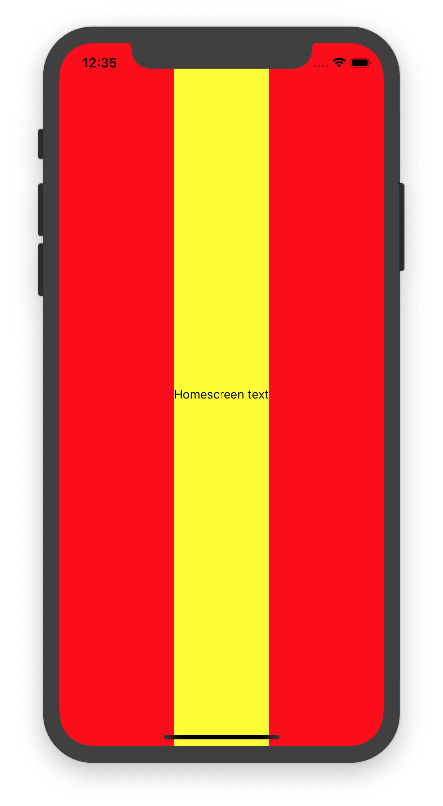
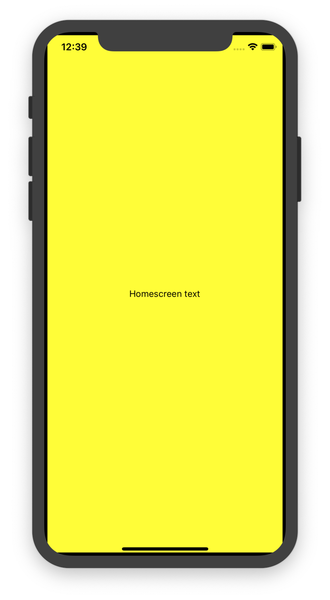

# Learnings

## By default children are only as wide as they need to be

Here I tried to put `HomeScreen` in `Container` and the `HomeScreen`
component, although it has `flex: 1` it takes exactly the space it needs.

## Padding vs Margin

* **Padding** is the amount between the content and the border
* **Margin** is the amount between two elements

This is with a border but with no margin and no padding. 

