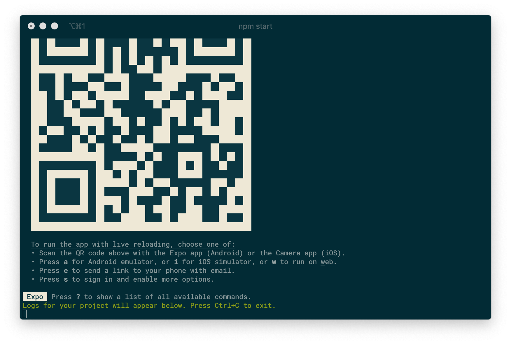
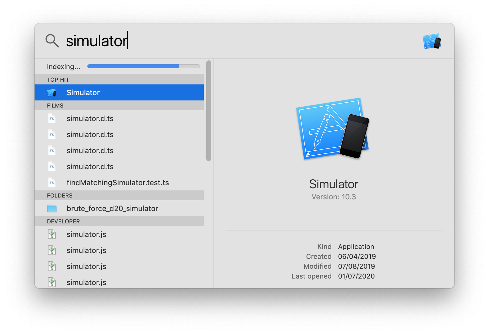
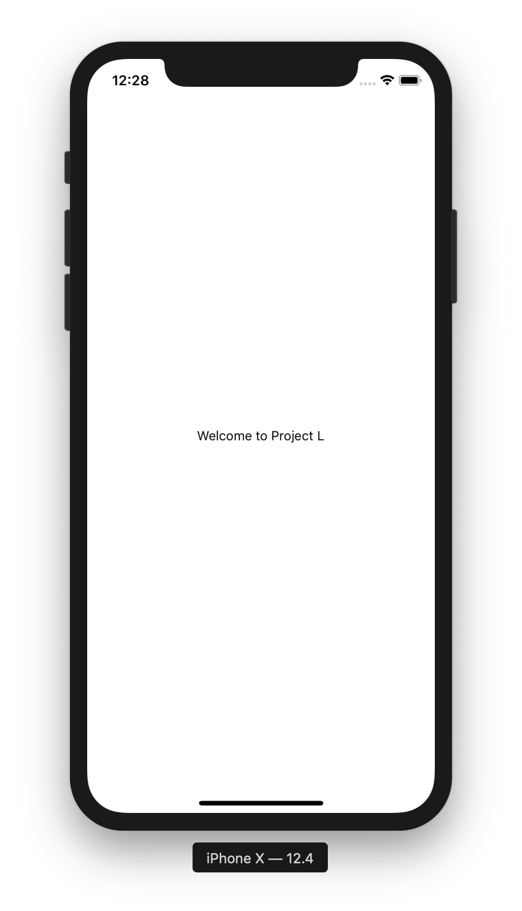

# Project L

Project L (L stands for location) is a tool that automatically populates your
agenda based on where you've been.

## Getting started

To get started clone and run the project.

```
git clone https://github.com/Rainymood/project-l
cd project-l
npm install
npm start
```

That should result in something like this.



Now open a simulator on your Mac.



Wait until the iOS simulator is finished booting. Then, press `i` in the
terminal window where you ran `npm start`.



🎉 Congratulations! You just built the project succesfully.